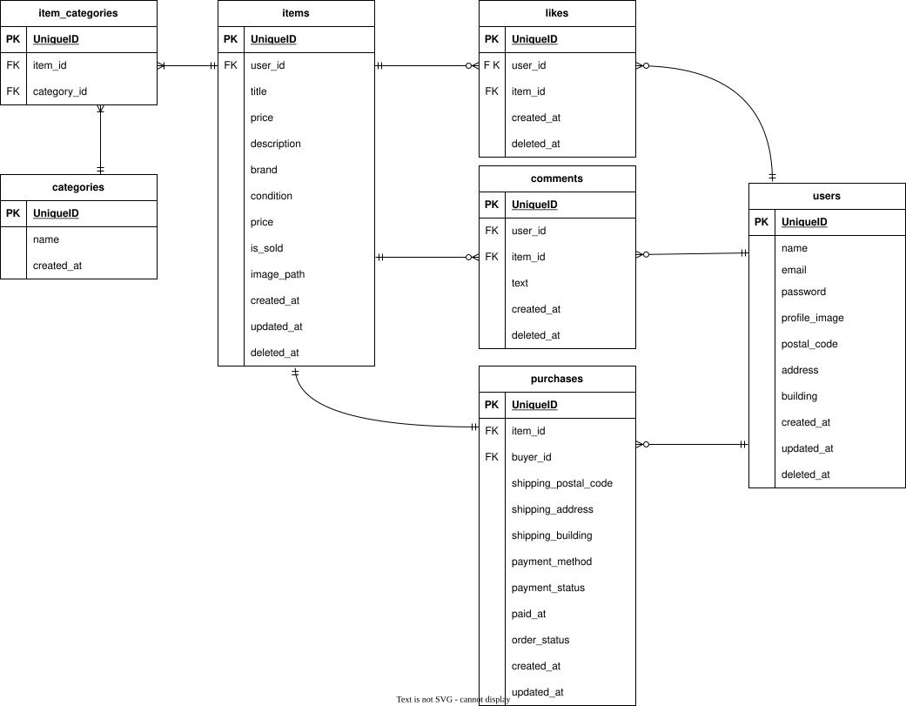

# flea-market-app(フリマアプリ)

## 環境構築

### Docker ビルド

1.  `git clone git@github.com:yoko-bessho/flea-market-app.git`
2.  DockerDesktop アプリ立ち上げる.
3.  `docker compose up -d --build`

Mac の M1・M2 チップの PC の場合、no matching manifest for linux/arm64/v8 in the manifest list entries のメッセージが表示されビルドができないことがあります。 エラーが発生する場合は、docker-compose.yml ファイルの「mysql」内に「platform」の項目を追加で記載してください

```
mysql:
   image: mysql:8.0.26
   platform: linux/x86_64   //(この文追加)

```

### Laravel 環境構築

1.  `docker-compose exec php bash`
2.  `composer install`
3.  「.env.example」ファイルをコピーして,「.env」へ名称変更
    `cp .env.example .env`

4.  .env に以下の環境変数を追加.

```
DB_CONNECTION=mysql
DB_HOST=mysql
DB_PORT=3306
DB_DATABASE=laravel_db
DB_USERNAME=laravel_user
DB_PASSWORD=laravel_pass
```

5. アプリケーションキーの作成.
   `php artisan key:generate`

6. マイグレーションの実行.
   `php artisan migrate`

7. シーディングの実行.
   `php artisan db:seed`

8. シンボリックリンク作成.
   `php artisan storage:link`

9. mailtrap の設定
   Mysandbox を開き、php 一覧より laravel のバージョン選択後、環境変数とパスワードをコピーし、.env へ貼り付ける
   デフォルト部分はコメントアウトか削除する
   その後

   ```
   php artisan config:clear
   ```

10. stripe の API キー設定

```
composer require stripe/stripe-php
```

```
brew install stripe/stripe-cli/stripe
```

ダッシュボードより公開可能 key とシークレット key を、CLI キーをコピーし、.env へ記述する

```
STRIPE_PUBLIC_KEY=公開可能キー
STRIPE_SECRET_KEY=シークレットキー
```

webhook 受け取りルート設定

```
stripe listen --forward-to http://localhost/api/stripe/webhook
```

実行時に出る

> Ready! You are using Stripe API Version [2025-07-30.basil]. Your webhook signing secret is whsec_xxxxx を
> .env の STRIPE_WEBHOOK_SECRET に設定する

```
STRIPE_WEBHOOK_SECRET=whsec_xxxxx
```

### 使用技術（実行環境）

・ PHP 7.4.9.
　・ Laravel Framework 8.83.8.
　・ mysql Ver 15.1.
　・ 認証：mailtrap
　・ 決済：stripe version 1.29.0

## テーブル設計

- [users](#1-users)
- [items](#2-items)
- [categories](#3-categories)
- [item_categories](#4-item_categories)
- [likes](#5-likes)
- [comments](#6-comments)
- [purchases](#7-purchases)

---

### 1. users

| カラム名          | 型              | PRIMARY KEY | UNIQUE KEY | NOT NULL | FOREIGN KEY |
| ----------------- | --------------- | ----------- | ---------- | -------- | ----------- |
| id                | unsigned bigint | ○           |            | ○        |             |
| uuid              | varchar(255)    |             | ○          | ○        |             |
| name              | varchar(255)    |             | ○          | ○        |             |
| email             | varchar(255)    |             | ○          | ○        |             |
| password          | varchar(255)    |             |            |          |             |
| profile_image     | varchar(255)    |             |            |          |             |
| postal_code       | char(7)         |             |            |          |             |
| address           | varchar(255)    |             |            |          |             |
| building          | varchar(255)    |             |            |          |             |
| email_varified_at | timestamp       |             |            |          |             |
| created_at        | timestamp       |             |            |          |             |
| deleted_at        | timestamp       |             |            |          |             |

---

### 2. items

| カラム名    | 型                | PRIMARY KEY | UNIQUE KEY | NOT NULL | FOREIGN KEY    |
| ----------- | ----------------- | ----------- | ---------- | -------- | -------------- |
| id          | unsigned bigint   | ○           |            | ○        |                |
| user_id     | unsigned bigint   |             |            | ○        | users(id)      |
| title       | varchar(255)      |             |            | ○        |                |
| description | text              |             |            | ○        |                |
| price       | unsigned smallint |             |            | ○        |                |
| brand       | varchar(255)      |             |            | ○        | categories(id) |
| is_sold     | boolean           |             |            | ○        |                |
| image_path  | varchar(255)      |             |            | ○        |                |
| condition   | varchar(255)      |             |            |          |                |
| created_at  | timestamp         |             |            |          |                |
| deleted_at  | timestamp         |             |            |          |                |

---

### 3. categories

| カラム名   | 型              | PRIMARY KEY | UNIQUE KEY | NOT NULL | FOREIGN KEY |
| ---------- | --------------- | ----------- | ---------- | -------- | ----------- |
| id         | unsigned bigint | ○           |            | ○        |             |
| name       | varchar(255)    |             | ○          | ○        |             |
| created_at | timestamp       |             |            |          |             |

---

### 4. item_categories

| カラム名    | 型              | PRIMARY KEY | UNIQUE KEY | NOT NULL | FOREIGN KEY    |
| ----------- | --------------- | ----------- | ---------- | -------- | -------------- |
| id          | unsigned bigint | ○           |            | ○        |                |
| item_id     | unsigned bigint |             |            | ○        | items(id)      |
| category_id | unsigned bigint |             |            | ○        | categories(id) |

---

### 5. likes

| カラム名   | 型              | PRIMARY KEY | UNIQUE KEY              | NOT NULL | FOREIGN KEY |
| ---------- | --------------- | ----------- | ----------------------- | -------- | ----------- |
| id         | unsigned bigint | ○           |                         | ○        |             |
| user_id    | unsigned bigint |             | UNIQUE(user_id,item_id) | ○        | users(id)   |
| item_id    | unsigned bigint |             | UNIQUE(user_id,item_id) | ○        | items(id)   |
| created_at | timestamp       |             |                         |          |             |

---

### 6. comments

| カラム名   | 型              | PRIMARY KEY | UNIQUE KEY | NOT NULL | FOREIGN KEY |
| ---------- | --------------- | ----------- | ---------- | -------- | ----------- |
| id         | unsigned bigint | ○           |            | ○        |             |
| user_id    | unsigned bigint |             |            | ○        | users(id)   |
| item_id    | unsigned bigint |             |            | ○        | items(id)   |
| text       | text            |             |            | ○        |             |
| created_at | timestamp       |             |            |          |             |
| deleted_at | timestamp       |             |            |          |             |

---

### 7. purchases

| カラム名             | 型              | PRIMARY KEY | UNIQUE KEY | NOT NULL | FOREIGN KEY |
| -------------------- | --------------- | ----------- | ---------- | -------- | ----------- |
| id                   | unsigned bigint | ○           |            | ○        |             |
| item_id              | unsigned bigint |             |            | ○        | items(id)   |
| buyer_id             | unsigned bigint |             |            | ○        | users(id)   |
| shipping_postal_code | char(7)         |             |            | ○        |             |
| shipping_address     | varchar(255)    |             |            | ○        |             |
| shipping_building    | varchar(255)    |             |            |          |             |
| payment_method       | varchar(20)     |             |            | ○        |             |
| payment_status       | varchar(20)     |             |            | ○        |             |
| paid_at              | timestamp       |             |            |          |             |
| checkout_session_id  | string          |             |            | ○        |             |
| created_at           | timestamp       |             |            |          |             |
| updated_at           | timestamp       |             |            |          |             |

### ER 図



### URL

・ 開発環境：http://localhost/
　・ phpMyadmin：http://localhost:8080/
